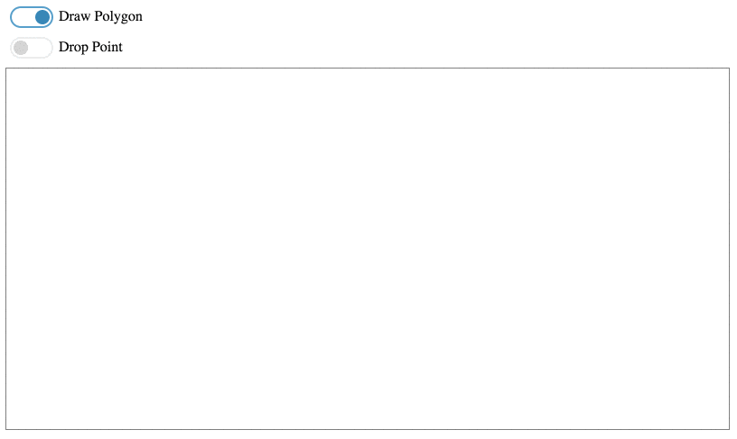

Vector-Cross-Product
====================

It is written in [React.js](https://github.com/facebook/react) and is for telling whether a given point is inside or outside the given **convex** polgon. **(not appropriate for concave polygon)**

Reference: [cross-product](https://www.mathsisfun.com/algebra/vectors-cross-product.html)

